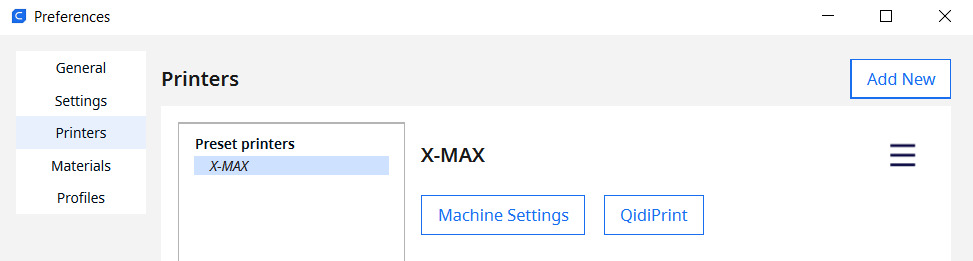

# QidiPrint Plugin for Ultimaker Cura 5.x

## Plugin for Ultimaker Cura v5.x that allows monitoring and printing on QIDI Printers over network, Supports webcams

This plugin is based on the great work of [Aleksey Sokolov](https://github.com/alkaes) and the fork adapted for 5.x by [Nick Kuvyrkin](https://github.com/nkuvyrkin). Original sources are [here](https://github.com/alkaes/QidiPrint) and [here](https://github.com/nkuvyrkin/Ultimaker-Cura-v5.x-QIDI-X-CF-Pro-Plugin).

Should be working with the following printers, their definitions have been aggregated from the two sources mentioned before.

* Qidi Tech 1
* Qidi Tech X-Maker
* Qidi Tech X-Max
* Qidi Tech X-One2
* Qidi Tech X-Plus
* Qidi Tech X-Pro
* Qidi Tech X-Smart
* QiDi Tech X-CF Pro

__Plugin has up to date only been tested using Cura 5.6.0 on Microsoft Windows printing to a Qidi X-Max.__

## ToBeUpdated

## Print menu button

## Printer Monitor (idle)

## Printer Monitor (printing)

## Installation

With Cura not running, unpack the zip file from the
[release](https://github.com/nkuvyrkin/Ultimaker-Cura-v5.x-QIDI-Printer-Plugin/releases/latest) to this specific folder:

  * Windows: `%USERPROFILE%\AppData\Roaming\cura\5.2.1\`
  * MacOS: `~/Library/Application Support/Cura/5.2.1/`
  * Linux: `/home/<username>/.local/share/cura/5.2.1/`

## Configuration

**Do NOT try to add a new "networked printer"!** This is only for Ultimaker printers.

**If you did not use printer definitions archive from above to add Qidi printer, in order for this plugin working properly, your printer.def.json must have "manufacturer" property set to "Qidi"**

QIDI printers are configured through the extension menu bar:

* Start Cura
* Inside the cura Prefernces->Printers selct and activate your printer
* Click "QidiPrint" button right to the Machine Settings button:

* A new window will pop-up with detected printers list (you also can add them manually by pressing the Add button)

* While adding a new printer manually (or by pressing Edit) the address of a webcam inside the printer (has to be added seperatly) can be configured

* Choose your printer and press the "Connect" button
* Click "Close"
* Done!

Now you can load a model and slice it. Then look at the bottom right - there
should be the big blue button with you printer name on it!
